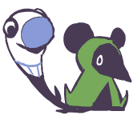

# Overview 

  

    
The Meekler is a shy rat with a sock for a tail. Although he and his sock are extremely mischevious, he is rather scared of everything, including our beloved Potheads.

  

  

    
  

::: info
Some links that say "capture" *should* direct you to the bottom of the page to **Meekler's Capturing Mechanic**, but since this page isn't long enough, it may not scroll the screen.
:::
# Behaviour 
### Inspection
Meekler starts by peeking his tail around a corner where a player is. 
If the player gets too close to the corner or walks past it, he will [capture](#capture) the player.
Otherwise, Meekler will slowly show itself from behind the corner and follow the player.

### Chase
If the player begins to walk away, Meekler will continue to follow the player, but will not capture.
If the player does begin to run away, Meekler will start chasing at increasing speeds until it gets 
close enough, at which point he will [capture](#capture) the player.

### How to deal with Meekler
The player can either lose Meekler by escaping from its line of sight, 
or run directly at him, causing him to be scared and run away.

# Meekler's Capturing Mechanic {#capture}
Meekler will whip his tail to hit the player, trapping them in the tail. He will then proceed to run away to some location away from any other player and drop them off, dealing a bit of damage upon release.